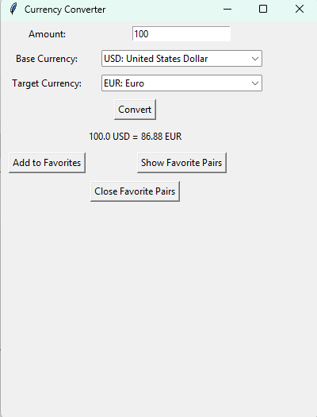
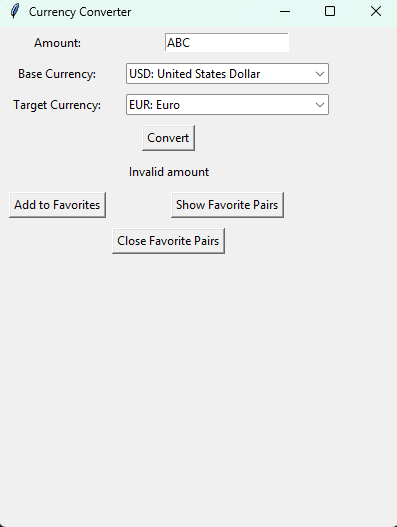

```markdown
# Currency Converter


A desktop application built with Python and Tkinter for converting currencies using real-time exchange rates from the ExchangeRate-API. Developed as part of the MITS Internship, it features a user-friendly GUI with support for mouse and keyboard inputs, a favorites system for saving currency pairs, and robust error handling.

## Table of Contents
- [Introduction](#introduction)
- [Features](#features)
- [Installation](#installation)
- [Usage](#usage)
- [Screenshots](#screenshots)
- [Contributing](#contributing)
- [License](#license)

## Introduction
The Currency Converter is a Tkinter-based application designed to convert amounts between currencies using live exchange rates. It allows users to select currencies from a comprehensive list, save favorite currency pairs to a JSON file, and interact via mouse or keyboard. The project, developed for the MITS Internship, demonstrates skills in Python, GUI development, API integration, and error handling.

## Features
- **Real-Time Conversion**: Fetches exchange rates using the ExchangeRate-API.
- **Favorites System**: Save and load favorite currency pairs (e.g., "USD to EUR") in a JSON file.
- **Input Methods**:
  - Mouse: Select currencies from dropdowns, click buttons to convert or manage favorites.
  - Keyboard: Type amounts, navigate dropdowns, press Enter to convert.
- **Error Handling**: Manages invalid inputs, network errors, and API issues with clear messages.
- **Portable**: Runs on any system with Python and minimal dependencies.

## Installation
Follow these steps to set up and run the Currency Converter locally:

1. **Clone the Repository**:
   ```bash
   git clone https://github.com/dhanraj0899/simple-calculator.git
   cd simple-calculator
   ```
2. **Ensure Python is Installed**:
   - Requires Python 3.9 or higher. Verify with:
     ```bash
     python --version
     ```
   - Tkinter is included with standard Python installations.
3. **Install Dependencies**:
   ```bash
   pip install requests python-dotenv
   ```
4. **Set Up API Key**:
   - Create a `.env` file in the project folder with:
     ```plaintext
     EXCHANGE_RATE_API_KEY=your_api_key_here
     ```
   - Obtain a free API key from [ExchangeRate-API](https://www.exchangerate-api.com).
5. **Run the Application**:
   ```bash
   python currency_converter.py
   ```

## Usage
- **Mouse Input**:
  - Enter an amount in the text field.
  - Select base and target currencies from dropdown menus.
  - Click "Convert" to see the result.
  - Use "Add to Favorites" to save currency pairs, "Show Favorite Pairs" to view them, or "Close Favorite Pairs" to hide the list.
- **Keyboard Input**:
  - Type the amount, use Tab or arrow keys to navigate dropdowns.
  - Press Enter to convert.
- **Example**:
  - Input: Enter "100", select "USD: United States Dollar" and "EUR: Euro", click "Convert."
  - Output: Display shows "100 USD = 92.50 EUR" (example rate).
  - Add "USD to EUR" to favorites, then select it from the favorites list for quick conversion.

## Screenshots
**Currency Conversion**:

*Caption: Converting 100 USD to EUR.*

**Error Handling**:

*Caption: Error message for invalid amount.*

## Contributing
Contributions are welcome! To contribute:
1. Fork the repository.
2. Create a branch: `git checkout -b feature-name`
3. Make changes and commit: `git commit -m "Add feature"`
4. Push to your fork: `git push origin feature-name`
5. Submit a pull request.

Please read [CONTRIBUTING.md](CONTRIBUTING.md) for guidelines (if added later).

## License
This project is licensed under the MIT License. See [LICENSE](LICENSE) for details.

*Last Updated: June 18, 2025*
```
